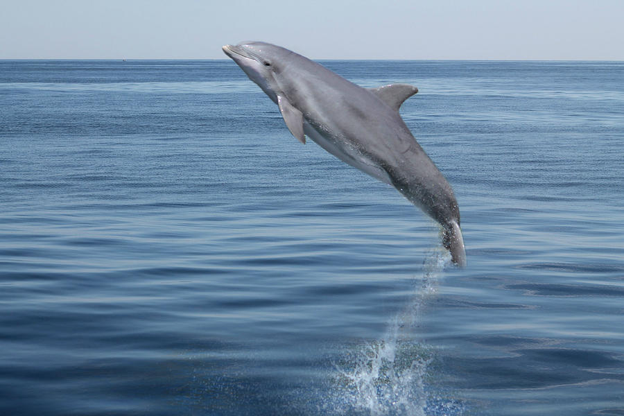

| [About](#about) | [Books](#books) | [Linux](#linux) | [Libraries](#libraries) | [Resources](#resources) |
| :-------------: | :-------------: | :-------------: | :---------------------: | :---------------------: |

# <table style="border-spacing: 4px" width="100%"><tr><td></td><td>Hi, I'm Greg and I like to make things</td></tr></table>

## My Journey

<table>
  <tr>
    <td>
    I started learning to code in the summer of 2016 when I took a course from EdX called LFS 101 - Linux for Starters. I enjoyed coding and decided I'd learn HTML, CSS, and JavaScript. I spent a year learning vanilla JS and CSS before moving on to jQuery and Bootstrap so I knew what was happening <em>under the hood</em>. It wasn't long before I started learning Git and GitHub.

Being a single father who worked 12 hour days, I didn't have a lot of time to devote to learning. However, I built several projects, some of which you can view on [my portfolio](https://portfolio.studio42dev.com), and earned the following certifications from freeCodeCamp during that time:

</td>
<td>

This is where it all started. Bus number 42.
</td>
  </tr>
</table>

<table style="border-spacing: 4px" width="100%">
<tbody>
<tr>
<td>

</td>
<td>
<a
              href="https://www.freecodecamp.org/certification/bus42/legacy-front-end"
              target="_new_window"
              >Front End (Legacy)</a
            >
</td>
</tr>
<tr>
<td>

</td>
<td>
<a
              href="https://www.freecodecamp.org/certification/bus42/front-end-development-libraries"
              target="_new_window"
              >Front End Development Libraries</a
            >
</td>
</tr>
<tr>
<td>

</td>
<td>
<a
              href="https://www.freecodecamp.org/certification/bus42/responsive-web-design"
              target="_new_window"
              >Responsive Web Design</a
            >
</td>
</tr>
<tr>
<td>

</td>
<td>
<a
              href="https://www.freecodecamp.org/certification/bus42/javascript-algorithms-and-data-structures"
              target="_new_window"
              >JavaScript Algorithms and Data Structures</a
            >
</td>
</tr>
</tbody>
</table>
Since then, my kids have grown and I have focused on JavaScript development in React and Node in a Linux environment. I spent long enough learning on my own and am now a student at Bloom Institute of Technology studying computer science and full-stack development with a focus on React, Node, SQL, and Agile methodologies.

While completing my education, I am freelancing as [Studio42 Dev](https://studio42dev.com). I build small websites, apps, and other projects for clients. My latest project is a serverless app that is built with React and ChakraUI and is deployed on Vercel.

---

## About Me

<table style="border-spacing: 4px" width="100%">
    <tbody>
        <tr>
            <td>
                
            </td>
            <td>
                

                I live in a tiny little town of just over 150 people and volunteer
                on my local fire department. I am trained in CPR, Basic Life
                Support, and first aid as well as extrication and traffic incident
                management. As it turns out, I can still manage to look goofy in
                structural gear.
                

            

              I'm a Linux fan but I like to play games too, and while you can
              play most titles on Linux, you can't play them all so I dual-boot
              on my PC. Also, I must like suffering because I dual-boot on my PC
              <em>and</em> do my own mechanical work on my Volkswagen.
            

          </td>
        </tr>
    </tbody>
</table>

---

### Some of My Favorite Books

<table style="border-spacing: 4px" width="100%">
    <tbody>
        <tr>
          <td></td>
          <td><a href="https://en.wikipedia.org/wiki/Dune_(novel)"
              target="_new_window" >Dune</a></td>
        </tr>
        <tr>
          <td></td>
          <td><a href="https://en.wikipedia.org/wiki/The_Hitchhiker%27s_Guide_to_the_Galaxy_(novel)"
              target="_new_window" >Hitchhikers Guide to the Galaxy</a></td>
        </tr>
        <tr>
          <td></td>
          <td><a href="https://en.wikipedia.org/wiki/War_and_Peace"
              target="_new_window" >War and Peace</a></td>
        </tr>
        <tr>
          <td></td>
          <td><a href="https://en.wikipedia.org/wiki/The_Pearl_(novella)"
              target="_new_window" >The Pearl</a></td>
        </tr>
    </tbody>
</table>

I love ThunderCats, Star Wars, Robot Chicken, and documentaries. I love cooking, and not cooking. I love to sing. I've only seen the first three Harry Potter movies, and I'm good with that. I vehemently dislike auto-tune, reality TV, and that plastic film that my friends never take off of their electronics.

---

### My Favorite Linux Distros

<table style="border-spacing: 4px">
      <tbody>
        <tr>
          <td>
            
          </td>
          <td>
            <a href="https://getfedora.org/"
              target="_new_window">Fedora</a> (RHEL) with KDE Plasma
            Desktop
          </td>
          <td>
          My daily driver. Beautiful, powerful, and easy to use. No
            wonder Linus uses it.
          </td>
        </tr>
        <tr>
          <td>
            
          </td>
          <td>
            <a href="https://ubuntubudgie.org"
              target="_new_window">Ubuntu Budgie</a> 
          </td>
          <td>
          Highly
            customizable and easy to use with some really nice quality of life
            features.
          </td>
        </tr>
        <tr>
          <td>
            
          </td>
          <td>
            <a href="https://garudalinux.org/index.html"
              target="_new_window">Garuda</a> KDE
            Dr460nized (Arch)
          </td>
          <td>
            The OS made for Linux Gamers
          </td>
        </tr>
        <tr>
          <td>
            
          </td>
          <td>
            <a href="https://manjaro.org/"
              target="_new_window">Manjaro</a> (Arch) Gnome
          </td>
          <td>
          Highly
            polished and easy to use Arch distro.
          </td>
        </tr>
        <tr>
          <td>
            
          </td>
          <td>
            <a href="https://peppermintos.com/"
              target="_new_window">PeppermintOS</a> (Debian)
          </td>
          <td>
          Super lightweight, yet powerful and fully featured. I run this on
            one of my decade+ old computers, of which I have a few - can't seem
            to get rid of them.
          </td>
        </tr>
      </tbody>
    </table>

---

### My Favorite Libraries

<table>
  <tr>
    <td>
      
    </td>
    <td>
      <a href="https://reactjs.org/"
              target="_new_window">React</a>
    </td>
    <td>
    The best JavaScript library
      for building user interfaces.
    </td>
  </tr>
  <tr>
    <td>
      
    </td>
    <td>
      <a href="https://chakra-ui.com/"
              target="_new_window">Chakra UI</a>
    </td>
    <td>
      A beautiful, accessible, and performant UI library for React.
    </td>
  </tr>
    <tr>
        <td>
        
        </td>
        <td>
        <a href="https://materializecss.com/"
              target="_new_window">Materialize CSS</a>
        </td>
        <td>
        A responsive, mobile-first front-end framework based on Material Design.
        </td>
    </tr>
    <tr>
        <td>
        
        </td>
        <td>
        <a href="https://expressjs.com/"
              target="_new_window">Express.js</a>
        </td>
        <td>
        A minimal and flexible Node.js web application framework that provides a robust set of features for web and mobile applications.
        </td>
    </tr>
    <!-- Sass -->
    <tr>
        <td>
        
        </td>
        <td>
        <a href="https://sass-lang.com/"
              target="_new_window">Sass</a>
        </td>
        <td>
        A CSS pre-processor, written in Ruby.
        </td>
    </tr>
    <!-- GSAP -->
    <tr>
        <td>
        
        </td>
        <td>
        <a href="https://greensock.com/gsap-js/"
              target="_new_window">GSAP</a>
        </td>
        <td>
        A library of animation and transformation effects for the web.
        </td>
    </tr>
    <!-- knex.js -->
    <tr>
        <td>
        
        </td>
        <td>
        <a href="https://knexjs.org/"
              target="_new_window">Knex.js</a>
        </td>
        <td>
        A query builder for PostgreSQL, MySQL, MariaDB, SQLite and Microsoft SQL Server.
        </td>
    </tr>

</table>

---

### Some of My Favorite People and Resources for Learning

This is anything but an exhaustive list.

- [freeCodeCamp](https://www.freecodecamp.org)
- [Wes Bos](https://wesbos.com)
- [The Net Ninja](https://www.youtube.com/channel/UCW5YeuERMmlnqo4oq8vwUpg)
- [EdX](https://www.edx.org)
- [Khan Academy](https://www.khanacademy.org)
- [The Linux Foundation](https://www.linuxfoundation.org)
- [You Don't Know JS](https://github.com/getify/You-Dont-Know-JS)
- [Eloquent JavaScript](https://eloquentjavascript.net)
- [Web Dev Simplified](https://m.youtube.com/c/WebDevSimplified)

---

So long, and thanks for all the fish!

Since you stuck around, here's a poorly edited video I made as as part of the Career Readiness portion of my Bloom Institute of Technology curriculum:

https://user-images.githubusercontent.com/20022081/153273447-d2d82557-d762-4eca-b786-b12cbc891f9a.mp4

